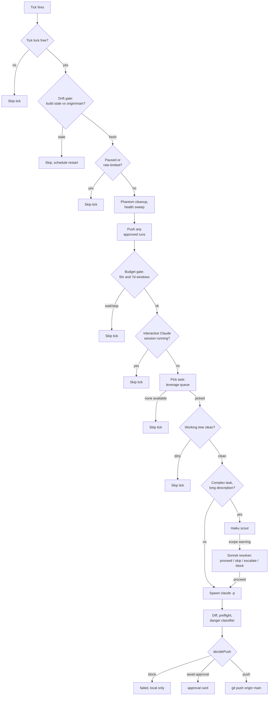

# Architecture

How ocean-bot works and why it is built this way. `README.md` covers getting it running; this document covers the reasoning.

Most of the design choices below exist because something specific broke in production first, not because they looked good on a whiteboard. Where that is true, this document says so.

## The problem

A solo maintainer's constraint on a side project is not ideas, it is continuity: keeping momentum on the boring 80% of the backlog without spending every evening supervising an agent one commit at a time. The obvious failure modes of automating that away are exactly the ones that make automation a bad idea. An agent that quietly corrupts data, spends real money, breaks an audit trail, or crash-loops itself in a way only a human can recover from is worse than no agent.

ocean-bot's design is organized around one question for every subsystem: *if this component is wrong, how much damage does it do before a human notices?* Routine work gets full autonomy. Anything that could do damage before a human notices gets a hard, deterministic gate in front of it, not a "please be careful" instruction to the model doing the work.

## The tick loop

ocean-bot is a long-running Node process. Every `tickIntervalSec` (default 180s) it runs one pass. The gates run in a fixed order, each able to end the tick early:

1. Acquire a tick lock, refuse if a prior tick is still running
2. Drift gate: is the running build stale relative to `origin/main`?
3. Paused (operator kill switch) or rate-limited (backing off from a recent 429)?
4. Phantom-run cleanup and health sweep
5. Push any runs the operator already approved from the dashboard
6. Budget gate: global and per-project token caps
7. Idle gate: is there an interactive Claude Code session open right now?
8. Pick a project and a task from the leverage queue
9. Working-tree gate: is the target repo dirty from unrelated work?
10. Execute: spawn `claude -p`, routed through a scout and resolver pre-check for large or ambiguous tasks
11. After the run: diff, preflight, classify danger, decide push
12. Push, hold for approval, or block

Most ticks end at step 2, 3, 6, 7, 8, or 9 with nothing happening. That is by design: the loop is cheap to run every three minutes, and the gates are ordered so the expensive step, actually spawning a Claude session, only happens once everything upstream has said yes. The lock is released in a `finally`, so a throw anywhere in the body cannot strand it.

Step 5 sits before the budget gate deliberately. Shipping an already-approved commit is a `git push`, which spends no tokens, and holding it hostage to a token budget would mean an operator's explicit approval could sit unexecuted for hours.

## The safety model

This is the part that matters most, because it is the part that is wrong exactly once before something bad ships.

### Danger classification: rule tiers, not vibes

Every diff the bot produces runs through an 11-rule classifier (`src/classifier.ts`) before a push decision is made. The rules split into two tiers:

| Rule | What it catches | Tier |
|---|---|---|
| 1 | Edits to publisher code, the layer that writes to customers' wikis | **critical** |
| 2 | Edits to the audit log, an append-only hash-chained record | **critical** |
| 3 | A destructive SQL pattern (`DROP`, `TRUNCATE`, `ALTER TYPE`) inside a schema-file diff | **critical** |
| 4 | Edits to a payment charge path | **critical** |
| 5 | Onboarding-doc code blocks changed | advisory |
| 6 | Diff over 500 changed lines or 10 files | advisory |
| 7 | A new external HTTP host appears in the diff | advisory |
| 8 | A credential-shaped file path is touched | **critical** |
| 9 | A CI workflow file changed | advisory |
| 10 | A destructive git command in the patch text (force-push, `reset --hard`, `branch -D`, `rebase`) | **critical** |
| 11 | The bot modified its own source | **critical** |

Under `manual` mode every run waits for a human regardless of tier. Under `auto` or `auto-with-visual`, a **critical** hit always forces an approval card; an **advisory** hit is recorded on the run and shown on the dashboard but does not block the push.

The split is the design decision worth defending. A flat 11-rule list meant every advisory hit demanded a human, and the predictable result was rubber-stamping: an operator who clears ten "diff is large" cards a day stops reading the eleventh, which is the one that mattered. Tiering restores meaning to the interrupt. `CRITICAL_RULE_IDS` is a hard-coded set pinned by tests, not a config value, so relaxing it requires a code change and a test change together.

The rules themselves are deliberately unglamorous: prefix matches on file paths and a few regexes over the raw patch text. Two of them have had real bypasses, which is worth stating rather than presenting the rule set as bulletproof:

- The credential-path rule originally anchored `.env` and `secret` to the *start* of a filename. `staging.env`, `aws-credentials.json`, `service-account-key.json`, and `id_ed25519` all walked past it. The fix splits the pattern into an unambiguous tier that always applies, and a looser filename-token tier applied only to non-source extensions, so `tokenizer.ts` does not false-positive on the word "token". Measured against 637 real files, the widened rule flags 8, all genuinely credential-adjacent.
- The destructive-git rule exempts the bot's own recovery code, which runs `git rebase --abort` after a failed rebase. The original exemption used a lookahead that scanned the rest of the line for `--abort`, so `git rebase origin/main && git rebase --abort`, or even a trailing comment mentioning `--abort`, suppressed the match entirely. The lookahead now scopes to the rebase invocation itself.

Neither was found by an adversary. Both were found by re-reading the regex. That is the honest state of a hand-rolled classifier: coverage is measured, not proven, and every rule is a standing invitation to find the next gap. Both fixes ship with the evading inputs as regression tests.

### Why a regex classifier and not an LLM judge

The obvious alternative is a second Claude call that looks at the diff and decides if it is dangerous. That was rejected deliberately.

The diff being judged was produced by an LLM-driven agent. Asking another LLM to judge it does not add a trust boundary, it is the same trust boundary wearing a different hat, and it inherits the same class of failure: a cleverly worded commit message or code comment could plausibly talk a judge model out of flagging something a human would catch immediately. A path-and-regex classifier cannot be reasoned with by its input. It also runs in milliseconds at zero token cost on every push decision, which matters when the loop ticks every three minutes, and its behavior is pinned by unit tests rather than drifting with a system prompt.

The tradeoff is real: the classifier only catches what its authors thought to encode. That cost is accepted in exchange for a gate that is deterministic, auditable, and cheap enough never to skip.

### Preflight and the push decision

After a task produces a commit, `src/push.ts` runs the project's preflight commands (typically the test suite and a type check) and then calls `decidePush()`:

- Preflight failure always blocks, regardless of mode.
- `manual` mode always routes to approval.
- A critical classifier hit always routes to approval in any non-manual mode.
- Otherwise the push proceeds.

Preflight commands are arbitrary project-controlled shell, so they run with a scrubbed environment (below), not the operator's own.

### Pushing without force

`pushToTarget()` never force-pushes. The first attempt is a plain `git push`. If the remote has moved it fetches, rebases once, and retries; if that fails it aborts the rebase to leave a clean tree and marks the run failed with the reason surfaced on the dashboard. Two failed attempts means a human looks at it, not a `--force`.

### Subprocess environment scrubbing

Every subprocess the bot spawns, the task runner, the scout, the resolver, and the preflight shell, builds its environment through `buildSafeChildEnv()` (`src/util/safe-env.ts`) rather than inheriting the operator's. It denies a fixed list of secret keys (the bot's database URL, worker-trigger secrets, payment keys, app private keys) plus anything matching `*_SECRET`, `*_PASSWORD`, `*_TOKEN`, or `*_PRIVATE_KEY`, with a narrow allowlist for the API keys the LLM client itself needs.

The threat model is explicit: task descriptions ultimately come from files and commit messages elsewhere in the repo, and a prompt-injected task should not be able to trick a spawned session into exfiltrating a database URL through a shell command.

## Budget control

`src/budget.ts` gates every tick against Claude Code usage, and it does so **observationally**, by reading what already happened, rather than predictively, by estimating what a task will cost.

Claude Code writes local transcripts as JSONL, and every assistant message carries a `usage` block with input, output, and cache token counts. The budget broker walks those files and sums them. To separate the bot's sessions from a human's interactive work, the runner writes one line per spawned session to a local ledger at spawn time; anything absent from that ledger does not count against the bot.

Two rolling windows are tracked, 5-hour and 7-day, mirroring the plan's own rate-limit structure. The gate returns `ok`, `wait` (within a configurable margin of the cap, default 10%), or `stop`. Both `wait` and `stop` skip the tick; the difference is how soon the bot retries.

Observational rather than predictive for a specific reason: exact per-window plan limits are not published, and Claude Code does not surface rate-limit headers to the caller. Actual local transcript usage is the only available source of truth. Predicting cost ahead of a run would mean guessing against numbers nobody can see, and a wrong guess in the safe direction wastes the plan while a wrong guess in the unsafe direction exhausts it.

Details worth calling out:

- The 5-hour window is anchored, not purely rolling. The first bot activity in a fresh window stamps an anchor, so the cap tracks the same window the upstream rate limiter uses rather than one that slides every tick.
- Per-project sub-caps are independent shares of the global pool, not a strict partition. The goal is to bound a single misbehaving project, for example a malformed task stuck in a retry loop, without requiring the shares to sum to 100%.
- Model selection (`src/model-select.ts`) folds several signals into one pick per task: a per-queue baseline, keyword overrides in the description (words like "concurrency" or "migration" push toward the larger model; "rename" or "typo" push toward the smaller), backlog severity, whether a prior attempt already failed on a cheaper model, and a budget throttle that downgrades one tier once utilization crosses a threshold.
- The output-token and tool-use caps are enforced by watching the live stream and sending `SIGTERM` once a threshold is crossed, not by passing a limit flag, because the CLI has none. The cap is therefore a post-hoc kill: a single very large turn can overshoot before the signal lands.

## Staying alive unattended

Several mechanisms below exist because ocean-bot broke in a specific, observed way. A bot running unattended on a laptop accumulates a long tail of "the process died mid-write" and "the operator's own workflow collided with the bot's" failures that are hard to anticipate.

### The boot wrapper

The launchd plist does not invoke `node dist/index.js`. It invokes `scripts/ocean-bot-launch.sh`, which on every restart:

1. Fetches `origin/main`, soft-failing on a network blip
2. Checks out `main` if another branch is current
3. Fast-forwards, exiting loudly if that is not possible, meaning real divergence rather than being offline
4. Rebuilds if any source file is newer than the build, or the build is missing
5. Stamps the built commit SHA to disk
6. Execs the Node process with secrets loaded from a sidecar env file

launchd's `ProgramArguments` runs one process, so "fetch, then build, then exec" is not expressible any other way. Because launchd restarts the process whenever it exits, a divergence or build failure exits with a distinct code and lets the restart loop retry the whole sequence rather than leaving a half-initialized process running.

### Drift detection

The stamped SHA is compared against the repo every tick (`src/drift.ts`). If they diverge, the running build is stale and the tick refuses to do real work.

Two refinements exist because the naive check produced false positives in production:

- The comparison target is `origin/main`, not local `HEAD`. When a run commits locally but has not pushed, local `HEAD` has moved while the build on disk still matches the last pushed state. Comparing against local `HEAD` treated the bot's own in-progress work as drift and refused to push it, a self-inflicted deadlock that shipped once.
- Not every commit that moves `origin/main` invalidates the running process. The check inspects which paths changed between the built SHA and the current reference, and downgrades to a non-blocking state when none touch the bot's own source.

Recovery is always a restart, never an in-process rebuild. Hot-swapping a running process's module graph is a real source of bugs, and launchd already restart-loops reliably.

### Health sweep

`src/health-sweep.ts` runs once per tick. It exists because of a specific regression: an auto-push path once skipped marking a completed backlog item done. The item stayed open, the bot re-picked it, got a no-op because the work had already shipped, and that no-op locked the item out of re-selection for 24 hours. The backlog looked frozen and nobody noticed until an operator went looking.

The sweep runs two kinds of check. Auto-fix checks repair a detected invariant violation in place: a shipped item still marked open, or a `running` row left by a process that died without recording a terminal state. Detect-only checks surface a pattern to the dashboard without touching data: a task that has failed the same way repeatedly, or an approved run that never got pushed. The split is deliberate. Auto-fix conditions are narrow and idempotent; false-positive auto-blocking a legitimately retrying task is worse than a stale dashboard row.

### Phantom-run cleanup

`src/phantom-cleanup.ts` targets a different class: runs left in an inconsistent terminal state rather than stuck mid-flight. It is rate-limited to once per 24 hours through a state-table timestamp, since the condition does not need per-tick attention.

## Two-stage risk triage

For tasks flagged complex with a long description, ocean-bot runs a cheap pre-check before committing an expensive session.

**The scout** (`src/scout.ts`) spawns a Haiku call with no tool access, asking only for a JSON verdict: a recommended model, an estimated turn count, and any scope warnings (unbounded asks, dangerous operations, ambiguous targets). It has a timeout and an in-process cache keyed by a hash of the description, so re-picking the same task does not pay twice. No warnings means the task proceeds straight to the main run.

**The resolver** (`src/scout-resolver.ts`) runs only when the scout raised a warning, and only under a non-manual mode, since manual mode already routes everything to a human. It spawns a Sonnet call, still tool-free, producing one of four verdicts:

- **proceed**: a technical scope question the bot can settle itself. The resolver may rewrite the description to narrow it, and when it can name a concrete pass/fail check it may attach acceptance criteria that wrap the prompt in a goal condition with a turn cap, so progress is evaluated between turns rather than only at the end.
- **skip**: underspecified in a way the codebase cannot resolve, or a dependency is not ready. Marked failed and excluded from re-selection for a day.
- **escalate**: a genuinely executive decision, product direction or anything outside the bot's mandate. Routes to an approval card.
- **block**: the task needs an action the bot structurally cannot perform, such as browser-based authentication or a third-party web form. Deliberately distinct from escalate: there is no ship-or-skip decision for an operator to make on a card, only an external action to take, so the backlog item is flipped to blocked with the reason attached rather than generating a card with no meaningful button.

Any parse failure, timeout, or malformed output defaults to escalate. An operator is more annoyed by an unnecessary approval click than by a missed safety net.

Sonnet, not Opus, runs the resolver. Distinguishing a technical scope question from an executive decision sits well within a mid-tier model, and the larger model would cost several times more for no measurable gain on that specific judgment.

## The adapter pattern

Every project implements one interface (`src/adapters/types.ts`), supplying:

- **Identity**: a stable name, the project root, and where its memory files live.
- **Queue methods**, each returning zero or more `TaskCandidate`s: a curated backlog, a red-test signal, gap closures inferred from recent commit messages, inline task markers, roadmap items, self-learning items, refactor flags, and a periodic open-ended creative pass. A candidate carries a one-line summary, a leverage score the picker sorts on, a token estimate, and optional hints.
- **Push rules**: which branch a commit lands on, and a `classifyDanger()` hook that runs the shared classifier with this project's own path configuration.
- **Verification**: preflight commands, and any visual surfaces worth screenshotting.

Two adapters are wired in: one for the primary product codebase, and one that manages the bot's own source as a separate project with its own backlog, runs, and budget bucket, sharing a repository but scoped to a path prefix. That split exists so bot-infrastructure work carries a different risk profile: rule 11 flags any diff under that prefix as critical unconditionally, so every change the bot makes to itself lands on an approval card rather than auto-pushing.

`buildAdapters` in `src/index.ts` switches on the project name, so adding a project means writing a file and rebuilding, not dropping in a plugin.

## Data model

Five Postgres tables, in a database dedicated to the bot rather than shared with product data:

- **`ocean_bot_run`**: one row per attempted unit of work. Status moves through `queued`, `running`, then `awaiting-approval`, `shipped`, or `failed`, with operator-driven `approved`, `rejected`, and `reverted` states. Tracks the branch and commit produced, push state, danger level and reasons, and a metadata blob (model, caps applied, resumed session, leverage score) the dashboard renders without a migration per field.
- **`ocean_bot_event`**: append-only per-run event log (tool use, results, messages, gate decisions, commits, pushes, errors), indexed on run and timestamp for the live run view.
- **`ocean_bot_usage`**: one row per observed transcript entry, tagged bot or interactive, with the token fields the budget broker sums.
- **`ocean_bot_state`**: a key/value table (pause flag, caps, drift status, health-sweep results, in-flight run) so the dashboard can read and write runtime state without a table per feature.
- **`ocean_bot_backlog_item`**: the curated work queue. Distinct from a run: a backlog item is a standing intent that may produce many runs or none, while a run is a single attempt.

## Known limitations, and what I would do differently

**Visual regression review is built but not wired in.** A real Playwright and pixelmatch implementation exists (`src/visual-inspect.ts`), with baseline capture, a mobile viewport, and a revision-feedback loop, but nothing in the tick loop calls it. `decidePush` is always passed a hard-coded `"skipped"` verdict, so `auto-with-visual` currently behaves identically to `auto`. This is the largest gap between design intent and the live pipeline, and wiring the existing module in should have ranked above most of the queue-scoring refinements that happened instead.

**The per-run token and tool-use caps are enforced after the fact.** The runner watches the stream and sends `SIGTERM` past a threshold. That bounds sustained runaway usage, but a single oversized turn can exceed the intended budget before the signal lands. A predictive per-turn budget would be tighter and would require the CLI to expose something it does not.

**The classifier's coverage is discovered, not proven.** Two real bypasses were found by re-reading regexes, not by an adversary. There is no reason to think those are the last two. The determinism and cost argument still holds, but this is an ongoing maintenance surface, and it deserves a periodic adversarial review rather than trust that the current rules are complete.

**The tick orchestrator is now tested, but not thoroughly.** For a long time `src/index.ts` had no direct tests at all, and could not have any: it called `main()` at module scope, so importing it started the bot. It is now guarded by an entry-point check, and `src/index.orchestration.test.ts` pins the part that matters most, that `executeRun` actually respects `decidePush`'s verdict. Those tests run the real `decidePush` and fake only the side effects, and each was checked by mutation rather than by passing: dropping the `return` after await-approval, closing the backlog item before the push, and treating a failed preflight as pushable each fail the specific tests written for them.

Coverage has since been extended to the two other paths where the loop makes a decision rather than plumbing a value. The rate-limit backoff: an open window skips the tick and still releases the lock, an elapsed one auto-clears so recovery needs no operator, a generic 429 backs off an hour while an exhausted credit pool backs off six, and an ordinary failure sets no pause at all. The scout handoff: all four resolver verdicts, the two side effects `proceed` has on the prompt the run actually receives, and the fail-safe that escalates when the resolver times out instead of reading silence as permission.

What remains uncovered is the recovery plumbing rather than the decisions: the dirty-tree stash and no-commit branches, the orphan-retry threshold that blocks a task caught in a loop, and the drift gate's self-restart path. Those are lower blast radius (they run after something has already gone wrong, and their failure mode is a confusing dashboard row rather than an unreviewed push), but they are not zero, and the honest description of this file is "its decision paths are pinned, its error paths are not."

**Most of the reliability layer was reactive.** The drift gate's origin-versus-local distinction, the health sweep, and the phantom cleanup were each added after an incident. That is a normal shape for this kind of system, but it means the current state is closer to "every known way this has broken is covered" than "every way this could break is covered."

**Auto-push is the default, and that is a deliberate bet.** Most work streams to `main` gated only by preflight and the seven critical rules, not by a human reading every diff. That is the point of the project, but the safety model's job is to make the bet survivable, not to eliminate it.

**Multi-project support exists mostly on paper.** The interface, the sub-caps, and the picker are written to be project-agnostic, but both wired adapters point at the same repository. The interface has never had to prove itself against a genuinely different codebase's constraints.

**It is a single-machine, single-operator design.** One launchd service, one lock file, one operator identity gating the dashboard. That is right for a personal tool and would need distributed locking, multi-tenant state, and a different trust model before it could serve a team.
